<!--
  VOLT Arc — free cinematic landing page template (HTML, GSAP, Lenis, Three.js). MIT licensed.
  Made by Vantle, an independent design and development studio: https://vantle.studio
-->

<a href="https://middlesugar7000.github.io/volt-arc-landing-page-template/">
  
</a>

<p align="center">
  <a href="https://middlesugar7000.github.io/volt-arc-landing-page-template/"></a>&nbsp;
  <a href="https://github.com/MiddleSugar7000/volt-arc-landing-page-template/generate"></a>&nbsp;
  <a href="https://github.com/MiddleSugar7000/volt-arc-landing-page-template/archive/refs/heads/main.zip"></a>
</p>

<p align="center">
  
  
  
  
  <a href="https://vantle.studio/?utm_source=github&utm_medium=badge&utm_campaign=volt-arc"></a>
</p>

# VOLT Arc — Free Dark Landing Page Template (HTML + GSAP + Three.js)

**VOLT Arc is a free, MIT-licensed, single-file landing page template for product launches.** It's a dark, cinematic, scroll-driven page for a fictional 204 hp electric hypersport motorcycle, with smooth scrolling (Lenis), scroll animations (GSAP ScrollTrigger), a procedurally generated Three.js electric motor and six product renders included. Open `index.html` and it runs: no framework, no npm, no build step.

Use it for an EV, hardware product, gadget, car, SaaS launch, pre-order or waitlist page. Swap the copy and images and you have a premium launch page in an afternoon.

> **Want one built for your own product?** This template was designed and coded by **[Vantle](https://vantle.studio/?utm_source=github&utm_medium=readme&utm_campaign=volt-arc)**, an independent design and development studio for brands, websites and software. We reply within one business day. **[Start a project →](https://vantle.studio/?utm_source=github&utm_medium=readme&utm_campaign=volt-arc#start)**

---

## Contents

- [Features](#features)
- [Quick start](#quick-start)
- [Customize it](#customize-it)
- [Page sections](#page-sections)
- [Tech stack](#tech-stack)
- [FAQ](#faq)
- [License](#license)
- [Need a custom landing page?](#need-a-custom-landing-page)

## Features



- **Single HTML file.** All markup, CSS and JS in `index.html`; the 3D motor lives in `assets/motor.js`.
- **Smooth, weighted motion.** Lenis smooth scroll, GSAP ScrollTrigger reveals, rolling stat counters and scroll-scrubbed sections.
- **Procedural 3D.** An axial-flux electric motor built entirely in Three.js code, no 3D model files.
- **Interactive bits.** Drive-mode switcher (Rain / Road / Track) and a "hold to launch" 0–100 km/h demo.
- **Six product images included** in `assets/` (WebP for the page, PNG originals for editing).
- **Noir design system.** Near-black surfaces, one lime accent (`#C6FF00`), Clash Display + Satoshi typography, hairline borders.
- **Responsive and accessible.** Fluid `clamp()` type, mobile layouts, and `prefers-reduced-motion` support.
- **SEO-ready.** Semantic headings, meta description, theme color and preloaded hero image.

## Quick start

```bash
git clone https://github.com/MiddleSugar7000/volt-arc-landing-page-template.git
cd volt-arc-landing-page-template
```

Open `index.html` directly, or serve the folder (recommended, because the Three.js module uses an import map):

```bash
npx serve .
```

**Deploy for free:** push to GitHub and enable **GitHub Pages**, or drag the folder into Netlify, Vercel or Cloudflare Pages.

## Customize it

| What | Where |
| --- | --- |
| Colors, radii, easing | CSS variables on `:root` in `index.html` (`--bg`, `--text`, `--lime`, `--r-card`…) |
| Fonts | The Fontshare `<link>` in `<head>` (Clash Display + Satoshi) |
| Copy, specs and prices | Plain HTML in `index.html` |
| Images | Replace files in `assets/` and keep the same names, or update the `src` attributes |
| 3D motor | `assets/motor.js` (Three.js, procedural geometry) |
| Accent color | Change `--lime` once and the whole page follows |

## Page sections

1. **Preloader** with a rolling percentage counter
2. **Hero** — "Violent." headline over the hero render
3. **Motor** — the procedural Three.js axial-flux motor
4. **Performance** — animated stats (204 hp, 240 Nm, 0–100 km/h)
5. **Ride** — full-bleed cinematic imagery
6. **Technology** — battery-as-chassis story, 150 kW DC charging, range
7. **Drive modes** and **Hold to launch** interaction
8. **Reserve** — pre-order / deposit call to action

## Tech stack

HTML5 · CSS (custom properties) · JavaScript (ES modules) · [GSAP 3](https://gsap.com) + ScrollTrigger · [Lenis](https://lenis.darkroom.engineering) · [Three.js](https://threejs.org) · Phosphor Icons · Fontshare fonts. All loaded from CDNs.

## FAQ

**Is this landing page template really free?**
Yes. VOLT Arc is released under the MIT license, so you can use it for personal and commercial projects, modify it and ship it. Keeping the license notice is the only requirement.

**Do I need React, Next.js or a build tool?**
No. It's a plain HTML/CSS/JS template. Open `index.html` or host the folder on any static host.

**What kind of product is it good for?**
Any launch that benefits from a dark, cinematic look: electric vehicles, hardware, gadgets, cars, AI products, SaaS launches, pre-orders and waitlists.

**Can I use the included images?**
Yes. The six renders in `assets/` ship with the template and can be used with it. Replace them with your own product shots for production.

**Who made this template?**
[Vantle](https://vantle.studio/?utm_source=github&utm_medium=faq&utm_campaign=volt-arc), an independent design and development studio that builds brands, websites and software products.

**Can you build a custom version for my business?**
Yes. Tell us about it at [hello@vantle.studio](mailto:hello@vantle.studio) or through the [project form](https://vantle.studio/?utm_source=github&utm_medium=faq&utm_campaign=volt-arc#start). We reply within one business day; a focused landing page usually takes 2 to 4 weeks.

## License

[MIT](LICENSE) © MiddleSugar7000. A ⭐ or a link back to [vantle.studio](https://vantle.studio/?utm_source=github&utm_medium=license&utm_campaign=volt-arc) is appreciated, never required.

## Built by Vantle

<a href="https://vantle.studio/?utm_source=github&utm_medium=readme&utm_campaign=volt-arc"></a>

<p align="center">
  <a href="https://vantle.studio/?utm_source=github&utm_medium=readme&utm_campaign=volt-arc#start"></a>&nbsp;
  <a href="https://vantle.studio/?utm_source=github&utm_medium=readme&utm_campaign=volt-arc#work"></a>&nbsp;
  <a href="mailto:hello@vantle.studio"></a>
</p>

VOLT Arc is a free template, and it comes from **[Vantle](https://vantle.studio/?utm_source=github&utm_medium=readme&utm_campaign=volt-arc)**, an independent design and development studio. We turn what you're building into a brand people remember, a website they understand, and a product they can use.

- **Brand & identity:** positioning, logo systems, typography, colour and full design systems
- **Web design & 3D:** launch pages, Three.js and WebGL, GSAP motion, responsive builds
- **Full-stack product:** SaaS platforms, dashboards, APIs, auth, payments and AI features

A focused landing page usually takes 2 to 4 weeks; a complete SaaS build 6 to 12. Tell us what you're making at [hello@vantle.studio](mailto:hello@vantle.studio) or through the [project form](https://vantle.studio/?utm_source=github&utm_medium=readme&utm_campaign=volt-arc#start), and we'll reply within one business day.

<a href="https://vantle.studio/?utm_source=github&utm_medium=readme&utm_campaign=volt-arc#work"></a>

<p align="center"><sub>Keywords: free landing page template, dark landing page template, product launch page, HTML GSAP template, Three.js landing page, Lenis smooth scroll, electric motorcycle website template, EV landing page, pre-order page template, MIT website template.</sub></p>

<!-- update: v1 -->
<!-- update: v2 -->
<!-- sync: 2026-10-08-r1 -->
<!-- sync: 2026-10-08-r2 -->
<!-- sync: 2026-10-08-r3 -->
<!-- sync: 2026-10-09-1 -->
<!-- sync: 2026-10-09-2 -->
<!-- sync: 2026-10-09-3 -->
<!-- sync: 2026-10-09-4 -->
<!-- sync: 2026-10-10-1 -->
